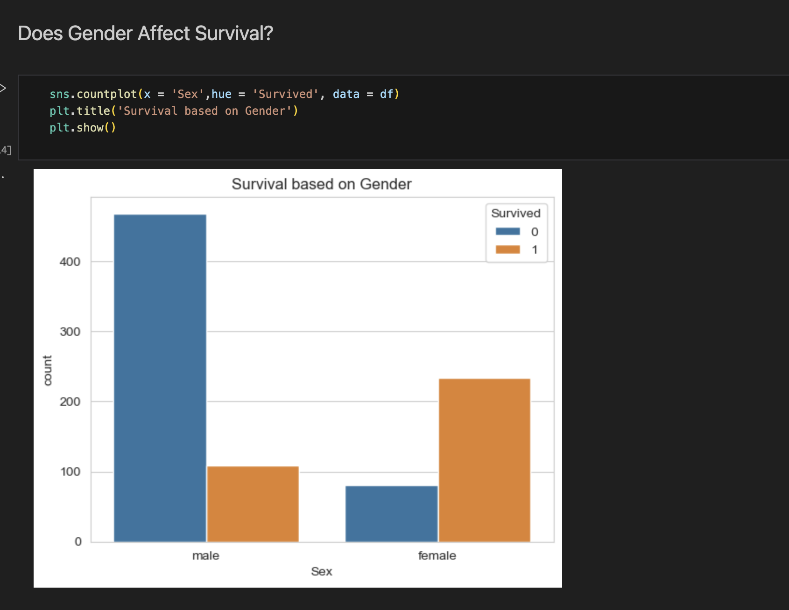
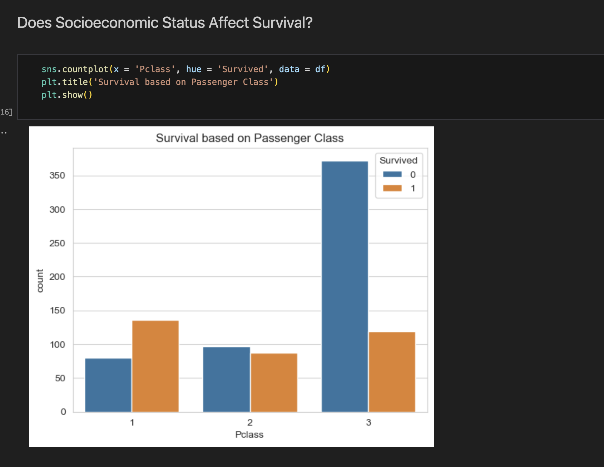
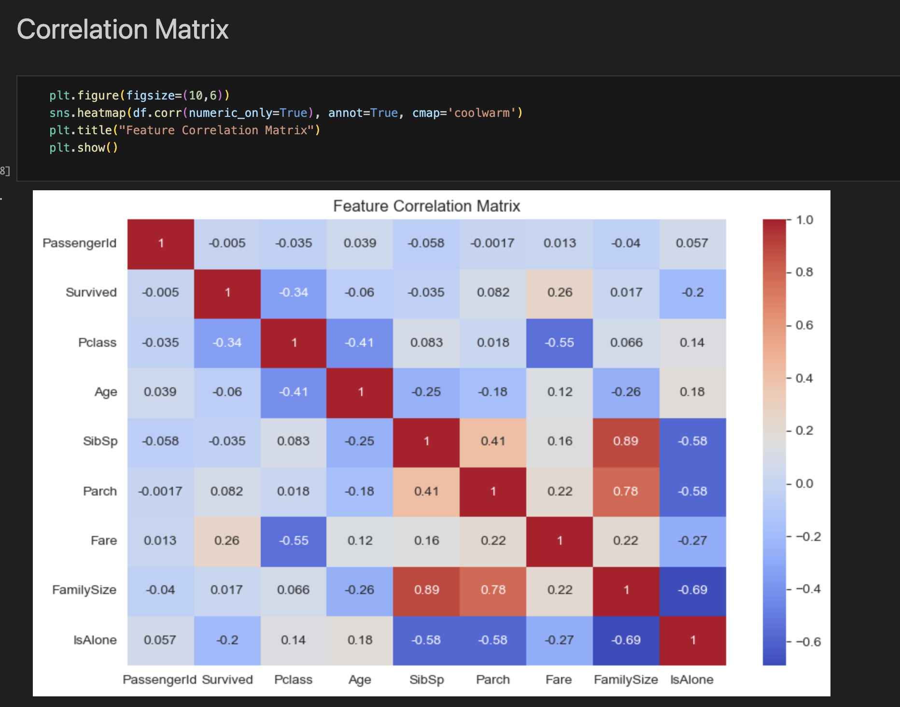
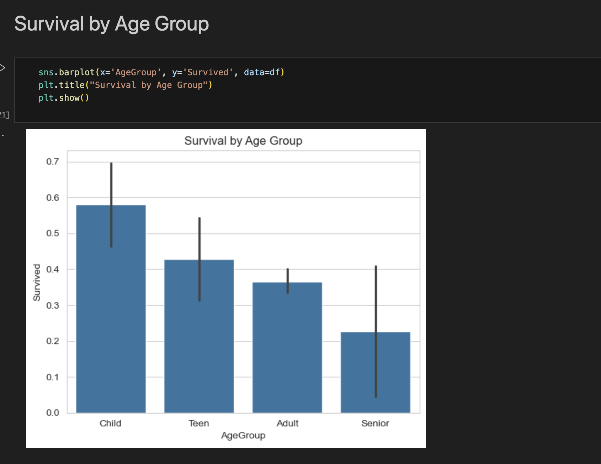

🚢 Titanic Survival Analysis (EDA using Python)

📌 Project Overview

This project performs Exploratory Data Analysis (EDA) on the Titanic dataset to identify key factors that influenced passenger survival.

🎯 Objective

To analyze passenger data and understand which features (such as gender, age, class, and fare) had the most impact on survival.

🛠️ Tools & Technologies

Python
Pandas
NumPy
Matplotlib
Seaborn

📊 Dataset

The dataset contains information about 891 passengers including:

Age
Gender
Passenger Class
Fare
Embarked Location
Survival Status

🔍 Steps Performed

1. Data Cleaning
Dropped Cabin column due to high missing values
Filled missing values in Age using median
Filled missing values in Embarked using mode
2. Feature Engineering
Created Family Size feature
Created Is Alone feature
Grouped Age into categories
Grouped Fare into ranges
3. Exploratory Data Analysis
Analyzed survival rate by gender
Analyzed survival by passenger class
Studied age distribution
Compared fare and survival
Used correlation heatmap

📈 Key Insights
Females had a much higher survival rate than males
Passengers in 1st class had higher survival chances
Higher fare passengers had better survival probability
Smaller families had better survival chances

📷 Visualizations
## 📊 Visualizations

✅ Conclusion

The analysis shows that gender, passenger class, and fare were the most important factors affecting survival. This project helped strengthen skills in data cleaning, feature engineering, and data visualization.
